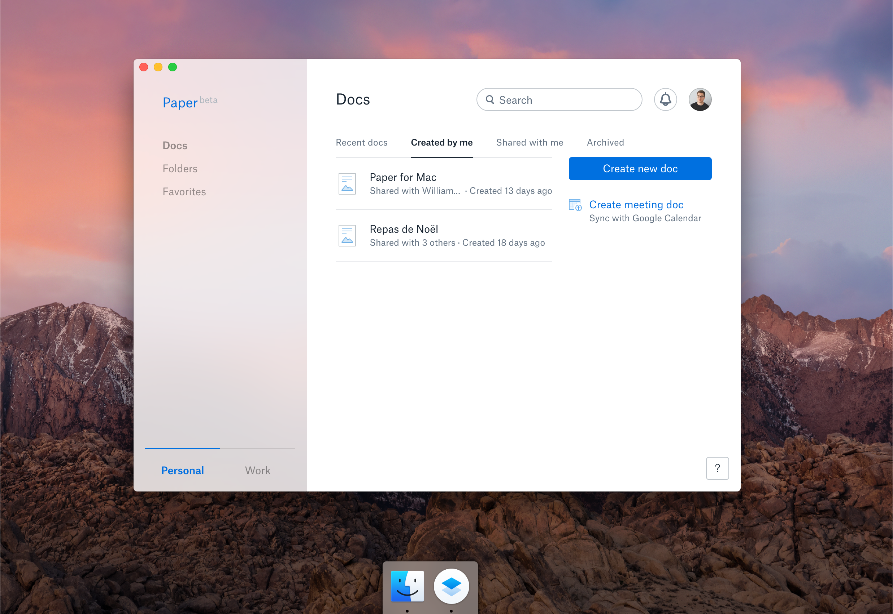

# Paper for Mac

> Unofficial Dropbox Paper client

## Download

[Paper for Mac](https://github.com/williambout/paper-for-mac/releases/download/v0.1.6/Paper.app.zip)

## Build

- Run: `$ npm start`
- Build: `$ npm run package`

## Known Issue

- External links don't work.

## License

MIT © [William Bout](http://williambout.me)
